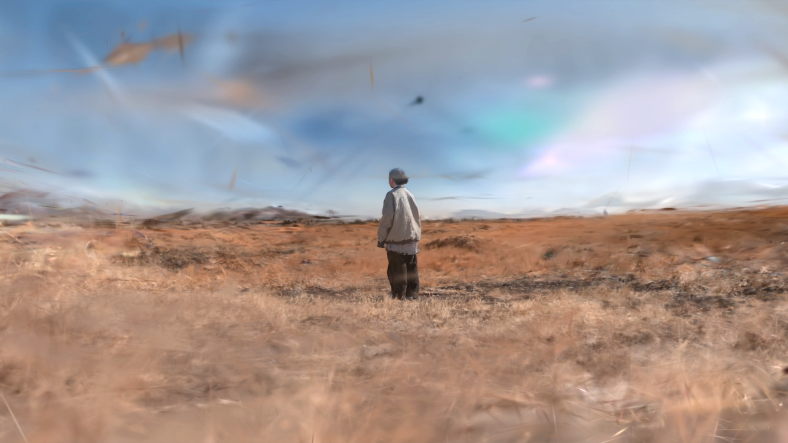
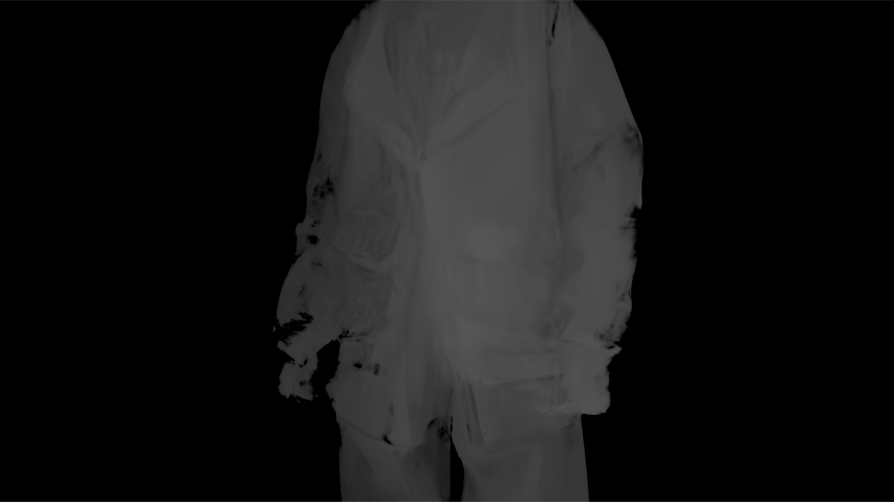
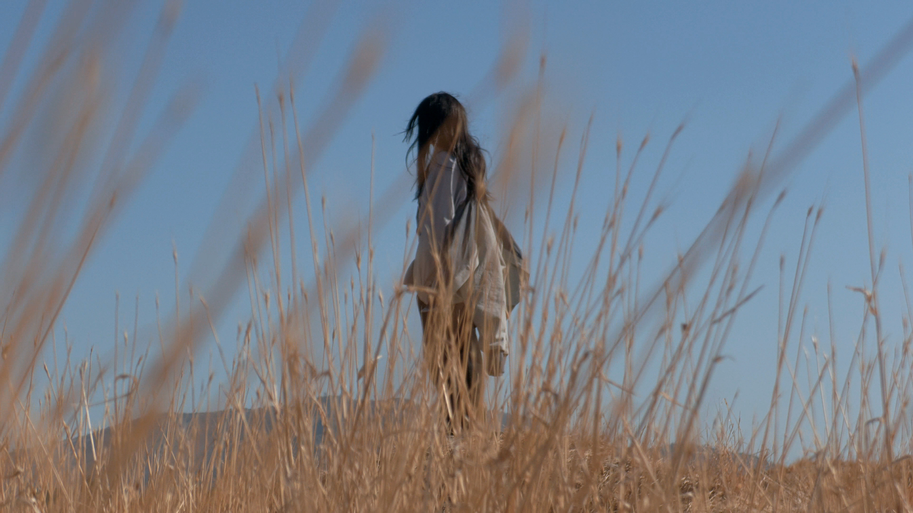
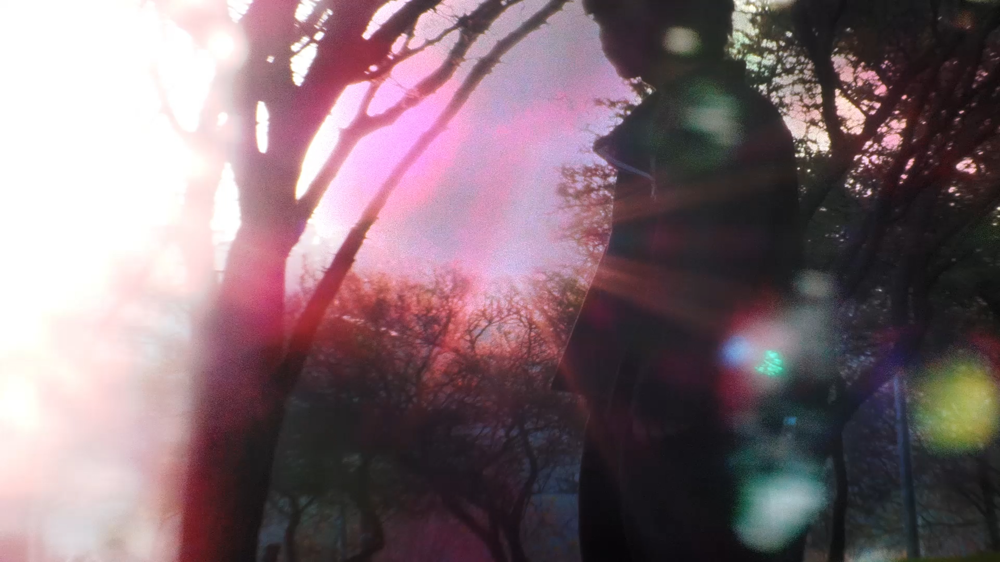
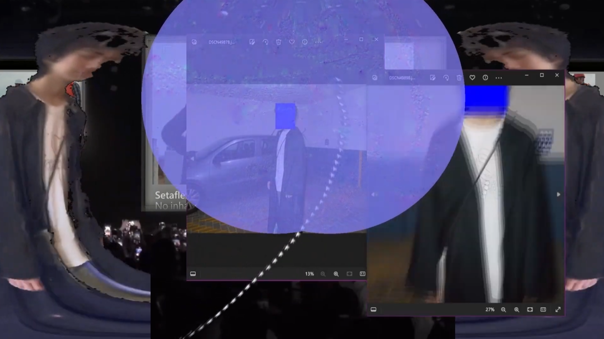
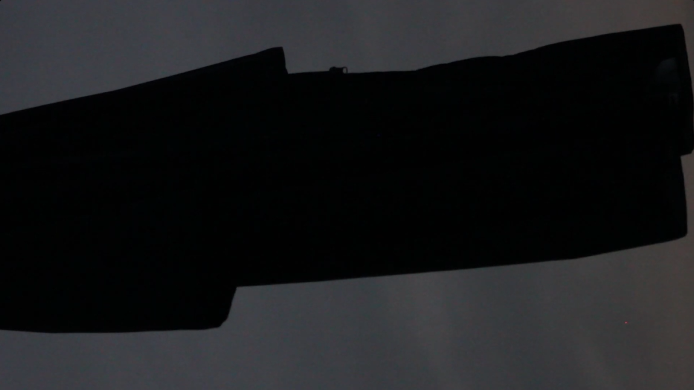
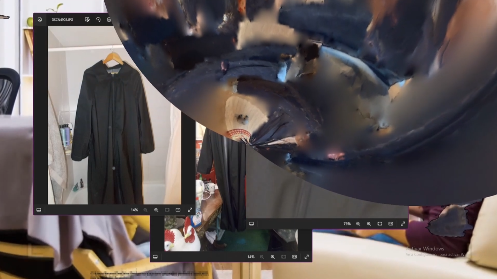
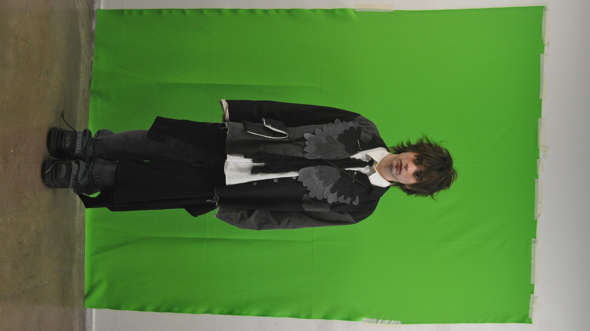
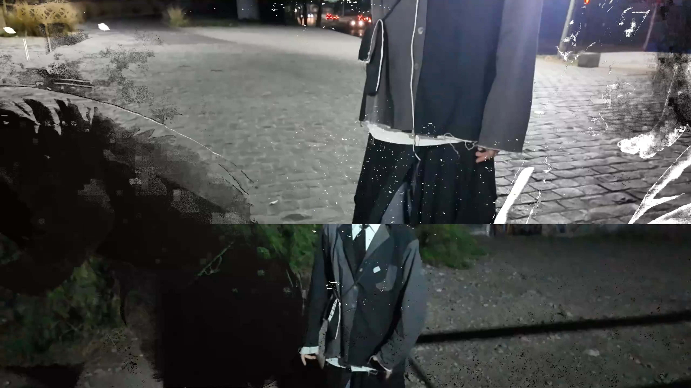
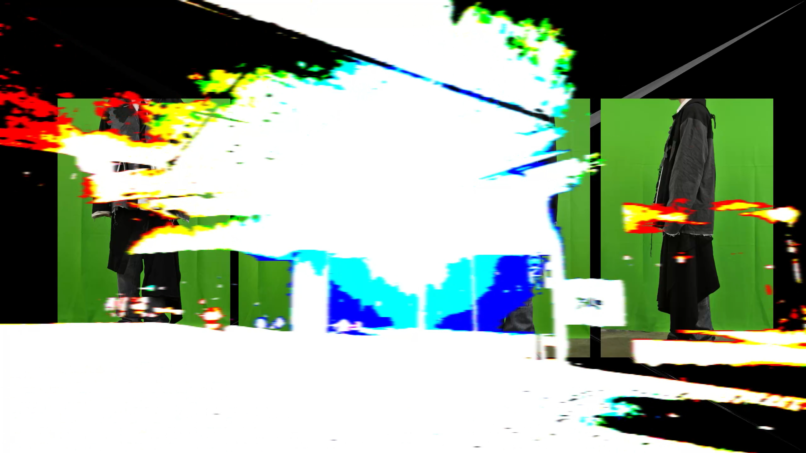

# $\color{White}\Huge{\textbf{alejandroperilla001}}$ [^1].

> https://www.instagram.com/mxna________/ *(final)*
>
> https://www.instagram.com/alejandroperilla001/ *(procesos)*
> 
> https://www.youtube.com/@alejandroperilla001 *(videos alta calidad)*

-----------------------------------------

*Es un hecho establecido hace demasiado tiempo que un lector se distraerá con el contenido del texto de un sitio mientras queusar textos como por ejemplo "Contenido aquí, contenido aquí". Estos textos hacen parecerlo un español que se puede leer.*

*Muchos paquetes de autoedición y editores de páginas web usan el Lorem Ipsum como su texto por defecto, y al hacer una búsqueda de "Lorem Ipsum" va a dar por resultado muchos sitios web que usan este texto si se encuentran en estado de desarrollo. Muchas versiones han evolucionado a través de los años, algunas veces por accidente, otras veces a propósito.*

-----------------------------------------

## $\color{White}\Huge{\textbf{Index}}$

### $\color{White}\large{\textbf{Ropa}}$

>[*Punto abierto*](https://github.com/alejandroperilla001/portafolio/tree/main#colorwhitelargetextbf1--punto-abierto)
>
>[*Short-1*](https://github.com/alejandroperilla001/portafolio/tree/main#colorwhitelargetextbf2--short-1)
>
>[*Pantalón-1*](https://github.com/alejandroperilla001/portafolio/tree/main#colorwhitelargetextbf3--pantal%C3%B3n-1)
>
>[*Chaqueta-2*](https://github.com/alejandroperilla001/portafolio/tree/main#colorwhitelargetextbf3--chaqueta-2)
>
>*Camisa-1*
>
>*Impermeable-1*
>
>*Blazer-1*

### $\color{White}\large{\textbf{Audio}}$

> [*Synth-1*](https://github.com/alejandroperilla001/portafolio#colorwhitelargetextbf6--synth-1)
>
> 

-----------------------------------------

## $\color{White}\Huge{\textbf{Portafolio}}$

### $\color{White}\large{\textbf{1:  Punto abierto}}$
  - **conjunto tejido + sesión fotográfica**

****Fotos sacadas en el Mall Araucano *(-33.401315, -70.575180)*. Se utilizó una Nikon D5000. Para editar se usó Davinci Resolve (Color, Montaje). El trabajo fue en grupo por lo que el resto de prendas son de compañeros. *(La mia siendo el chaleco)*****

- ****Especificaciónes:****
  - Patronaje propio (Chaleco suelto)
  - Hilado de algodón y lana

>*modelo: cris*
>
>*fotografía: yo*
>
>*gorro: cris + josefa*

-----------------------------------------

### $\color{White}\large{\textbf{2:  Short-1}}$
  - $\color{White}{\textsf{short deconstruido + video(stills)}}$

$\color{White}\large{\textbf{Grabado por Providencia (-33.41154774279605, -70.59934651215885).}}$
$\color{White}\large{\textbf{Para grabar se utilizó una Panasonic HC-X2000 y para editar se usó Davinci Resolve (Audio, Color, Montaje).}}$

$\color{White}\large{\textbf{Se creó una ruta por Providencia para grabar de manera contínua, desde el interiór del metro, por afuera}}$
$\color{White}\large{\textbf{y de vuelta. Se grabó con la camara dentro de una bolsa de Jumbo con un orifício, para poder caminar la ruta}}$
$\color{White}\large{\textbf{planeada mientras se grababa.}}$

- $\color{White}\large{\textbf{Especificaciónes:}}$
  - $\color{White}\large{\textbf{Patrón propio (Shorts acampanados deconstruidos)}}$
  - $\color{White}\large{\textbf{Bolsillo de vivo inverso (Dentro afuera)}}$
  - $\color{White}\large{\textbf{Detalles de hilvanado y tela deshilachada}}$
  - $\color{White}\large{\textbf{Bolsillos frontales sesgados}}$
  - $\color{White}\large{\textbf{Basta con costura invisible hecha a mano}}$
  - $\color{White}\large{\textbf{Cierre YKK}}$

>$\color{White}{\textsf{modelo: cris}}$
>
>$\color{White}{\textsf{grabación: yo}}$
>
>$\color{White}{\textsf{edición/color grading: yo}}$
>
>$\color{White}{\textsf{musica: yo (ableton)}}$
>
>[*video completo*](https://www.youtube.com/watch?v=CWF338GuosY)

-----------------------------------------

### $\color{White}\large{\textbf{3:  Pantalón-1}}$
  - $\color{White}{\textsf{pantalón modificado + video(stills)}}$

$\color{White}\large{\textbf{Grabado una oficina (-33.423317, -70.608844) amablemente facilitada para el proyecto por Mary.}}$
$\color{White}\large{\textbf{Se grabó y fotografió a gente desconocida en la calle (Sanhattan) sujetando el pantalón (2do still).}}$
$\color{White}\large{\textbf{Para grabar y sacar fotos se utilizó una Nikon D5600 y iPhone. Y para editar se usó Davinci Resolve}}$
$\color{White}\large{\textbf{y Sony Vegas 18 Pro (Audio, Color, Montaje).}}$

- $\color{White}\large{\textbf{Especificaciónes:}}$
  - $\color{White}\large{\textbf{Patrón no propio (Modificado en las rodillas y pretina)}}$
  - $\color{White}\large{\textbf{Mezclilla}}$
  - $\color{White}\large{\textbf{Remaches}}$
  - $\color{White}\large{\textbf{Cierre YKK}}$

>$\color{White}{\textsf{modelo: ???}}$
>
>$\color{White}{\textsf{grabación: yo}}$
>
>$\color{White}{\textsf{edición/color grading: yo}}$
>
>$\color{White}{\textsf{musica: newyork - rapstar}}$
>
>[*video completo*](https://www.youtube.com/watch?v=DZKmqcFhRBs)

-----------------------------------------

### $\color{White}\large{\textbf{4:  Chaqueta-2}}$
  - $\color{White}{\textsf{chaqueta mochila + video(stills)}}$

$\color{White}\large{\textbf{Grabado en Quilicura (-33.343065, -70.730248) con una Panasonic HC-X2000 y Nikon COOLPIX A10. Se usó Gaussian}}$
$\color{White}\large{\textbf{Splatting (Postshot) para el efecto "3D". Se editó en Davinci Resolve (Audio, Color, Montaje).}}$

- $\color{White}\large{\textbf{Especificaciónes:}}$
  - $\color{White}\large{\textbf{Patronaje propio (Chaqueta bomber/blazer)}}$
  - $\color{White}\large{\textbf{Cuerpo de algodón}}$
  - $\color{White}\large{\textbf{Forro tafetán}}$
  - $\color{White}\large{\textbf{Puño de algodón}}$
  - $\color{White}\large{\textbf{Tiras interiores para usar como mochila}}$

>$\color{White}{\textsf{modelo: bea}}$
>
>$\color{White}{\textsf{grabación: yo}}$
>
>$\color{White}{\textsf{edición/color grading: yo}}$
>
>$\color{White}{\textsf{ayuda: diego}}$
>
>$\color{White}{\textsf{musica: slauson malone 1 - undercommons}}$
>
>[*video completo*](https://www.youtube.com/watch?v=W_qiskR5X0A)

-----------------------------------------

### $\color{White}\large{\textbf{5:  Camisa-1}}$
  - $\color{White}{\textsf{camisa con cierre curvo + video(stills)}}$

$\color{White}\large{\textbf{Grabado en el Parque Bicentenario (-33.399612, -70.602811), en la FAAD (UDP) + compilación de imagenes.}}$
$\color{White}\large{\textbf{Se utilizó una Panasonic HC-X2000 y Nikon COOLPIX A10. Para efectos se usó TouchDesigner y para editar}}$
$\color{White}\large{\textbf{se usaron Davinci Resolve y Sony Vegas 18 Pro (Audio, Color, Montaje).}}$

- $\color{White}\large{\textbf{Especificaciónes:}}$
  - $\color{White}\large{\textbf{Patronaje propio (Camisa asimétrica)}}$
  - $\color{White}\large{\textbf{Cuerpo de algodón}}$
  - $\color{White}\large{\textbf{Hilo reflectante}}$
  - $\color{White}\large{\textbf{Cierre YKK}}$

>$\color{White}{\textsf{modelo: yo}}$
>
>$\color{White}{\textsf{grabación: yo/diego/cris}}$
>
>$\color{White}{\textsf{edición/color grading: yo}}$
>
>$\color{White}{\textsf{ayuda: diego/cris}}$
>
>$\color{White}{\textsf{musica: yo (ableton)}}$
>
>[*video completo*](https://www.youtube.com/watch?v=NZLylnTXRs8)

-----------------------------------------

### $\color{White}\large{\textbf{6:  Impermeable-1}}$
  - **chaqueta impermeable + video(stills)**

****Fotos sacadas por Providencia *(-33.419746, -70.606137)*. Se utilizó una Nikon D5000 y Nikon COOLPIX A10. Para editar se usó Sony Vegas 18 Pro (Color, Montaje). Se tomaron varias fotos de la chaqueta en publico y se creó un informativo sobre un producto no existente para tener de fondo en el video. También se usó fotogrametría para crear modelos 3D me mí usando la chaqueta.****

- ****Especificaciónes:****
  - Patronaje no propio (Modificado)
  - Tela impermeable
  - Forro malla
  - Elasticos en puño
  - Cierre impermeable

>*modelo: yo*
>
>*fotografía: yo*
>
>grabación: yo
>
>edición/color grading: yo
>
>ayuda: anto
>
>musica: yo (ableton)

-----------------------------------------

### $\color{White}\large{\textbf{7:  Blazer-1}}$
  - **blazer/bolso/falda + video(stills)**

****Videos grabados por Providencia *(-33.410579, -70.604302)* y fotos sacadas en la FAAD (UDP). Se utilizó una Nikon D5000 y Osmo Pocket 3. Para editar se usó Davinci Resolve y Sony Vegas 18 Pro (Color, Montaje). .****

- ****Especificaciónes:****
  - Patronaje propio
  - Tela Lino
  - Forro algodón
  - Terminado deshilachado y costuras a mano en bolsillo y basta
  - Botones concha perla

>*modelo: yo/cris*
>
>*fotografía: yo*
>
>grabación: yo/diego
>
>edición/color grading: yo
>
>ayuda: diego
>
>musica: weed420 - La Guerra De Los Sexos

-----------------------------------------

### $\color{White}\large{\textbf{6:  synth-1}}$
  - $\color{White}{\textsf{synth noise + video}}$

https://github.com/user-attachments/assets/3d1646ff-ac86-4db6-b7c6-03cf5cbab18f

-----------------------------------------

[^1]:arriba
https://github.com/orgs/community/discussions/31570
https://docs.github.com/es/get-started/writing-on-github/getting-started-with-writing-and-formatting-on-github/basic-writing-and-formatting-syntax
https://image-compressor.github.io
