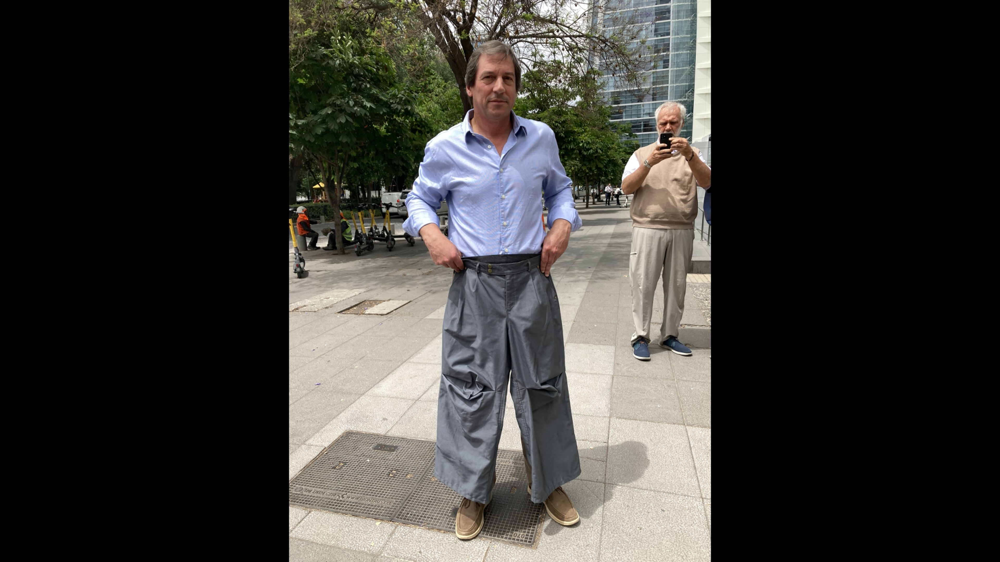

# $\color{White}\Huge{\textbf{alejandroperilla001}}$[^1].

> https://www.instagram.com/mxna________/
>
> https://www.instagram.com/alejandroperilla001/
> 
> https://www.youtube.com/@alejandroperilla001

-----------------------------------------

$\color{White}\large{\textbf{Es un hecho establecido hace demasiado tiempo que un lector se distraerá con el contenido del texto de un sitio mientras que}}$
$\color{White}\large{\textbf{mira su diseño. El punto de usar Lorem Ipsum es que tiene una distribución más o menos normal de las letras, al contrario de}}$
$\color{White}\large{\textbf{usar textos como por ejemplo "Contenido aquí, contenido aquí". Estos textos hacen parecerlo un español que se puede leer.}}$

$\color{White}\large{\textbf{Muchos paquetes de autoedición y editores de páginas web usan el Lorem Ipsum como su texto por defecto, y al hacer una }}$
$\color{White}\large{\textbf{búsqueda de "Lorem Ipsum" va a dar por resultado muchos sitios web que usan este texto si se encuentran en estado de desarrollo.}}$
$\color{White}\large{\textbf{Muchas versiones han evolucionado a través de los años, algunas veces por accidente, otras veces a propósito.}}$

---

## $\color{White}\Huge{\textbf{portafolio}}$
[pantalón test](https://github.com/alejandroperilla001/portafolio/edit/main/README.md#colorwhitelargetextbf3--pantal%C3%B3n-1)

### $\color{White}\large{\textbf{1:  punto abierto}}$
  - $\color{White}{\textsf{conjunto tejido + sesión fotográfica}}$

>$\color{White}{\textsf{modelo: cris}}$
>
>$\color{White}{\textsf{fotografía: yo}}$
>
>$\color{White}{\textsf{gorro: cris + josefa}}$

------------------------

### $\color{White}\large{\textbf{2:  short-1}}$
  - $\color{White}{\textsf{short deconstruido + video(stills)}}$

>$\color{White}{\textsf{modelo: cris}}$
>
>$\color{White}{\textsf{grabación: yo}}$
>
>$\color{White}{\textsf{edición/color grading: yo}}$
>
>$\color{White}{\textsf{musica: yo}}$
>
>[video completo](https://www.youtube.com/watch?v=CWF338GuosY)

------------------------

### $\color{White}\large{\textbf{3:  pantalón-1}}$
  - $\color{White}{\textsf{pantalón modificado + video(stills)}}$

>$\color{White}{\textsf{modelo: ???}}$
>
>$\color{White}{\textsf{grabación: yo}}$
>
>$\color{White}{\textsf{edición/color grading: yo}}$
>
>$\color{White}{\textsf{musica: newyork}}$
>
>[video completo](https://www.youtube.com/watch?v=DZKmqcFhRBs)

[^1]:arriba
https://github.com/orgs/community/discussions/31570
https://docs.github.com/es/get-started/writing-on-github/getting-started-with-writing-and-formatting-on-github/basic-writing-and-formatting-syntax
https://image-compressor.github.io
